## Saber Arquitetura do Sistema
$ arch

## Saber se tem vmx

#cat /proc/cpuinfo | grep vmx

## Registrar (Importante para poder utilizar os repositórios. Sem ele os repositórios não funcionam)

#subscription-manager register

#subscription-manager attach

## Instalar virtualização.

### Pesquisar Grupos de instalação

#dnf groulist

### Instalar grupo Virtualização

#dnf groupinstall -y "Virtualization Host"

#dnf groupinstall -y "Virtualization Client"

#systemctl status libvirtd

### Iniciar com a inicialização.

#systemctl enable libvirtd

## Acessar com ssh e acessar virtmanager

#ssh -X -lroot ip.da.maquina
 
 '-X ' -> permite visualizar aplicações gráficas remotamente.

## Acessar a estação e rodar o virt-manager 

#virt-manager &

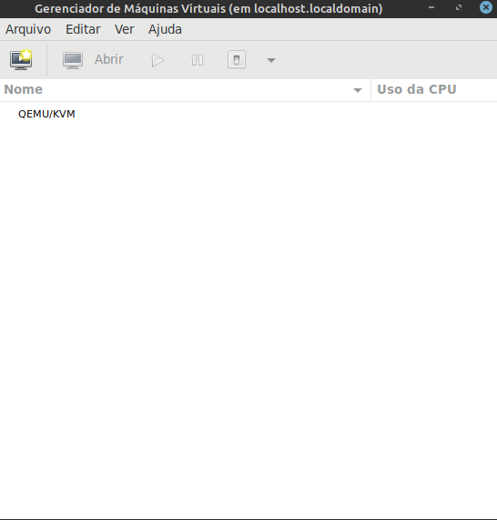
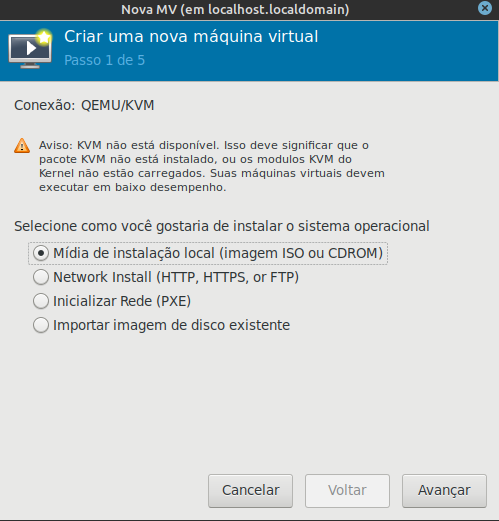
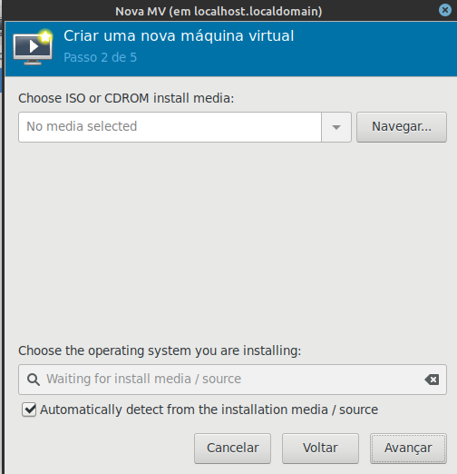
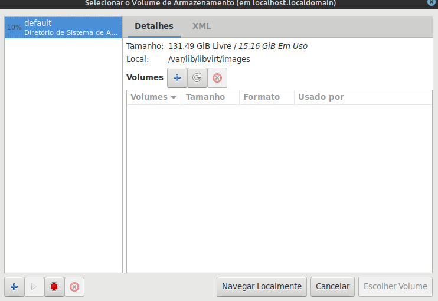
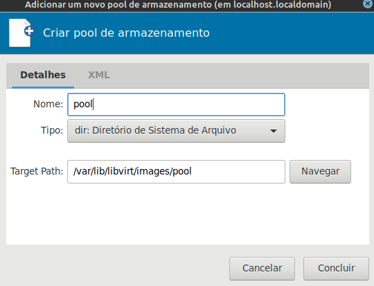
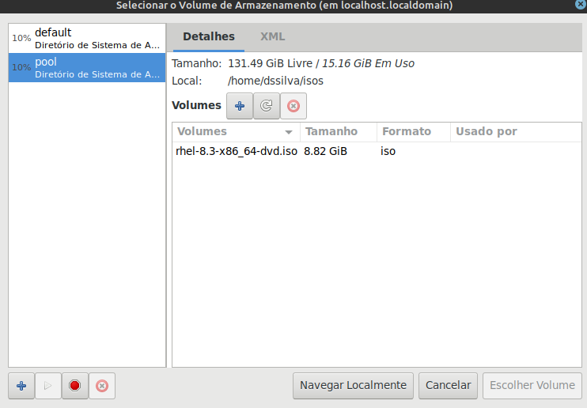
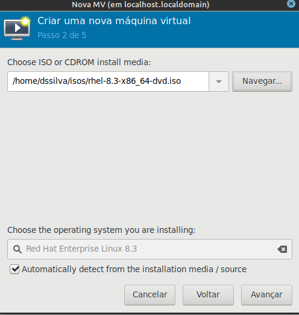
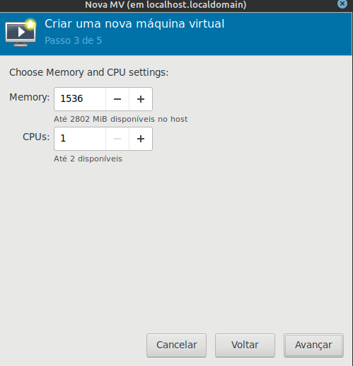
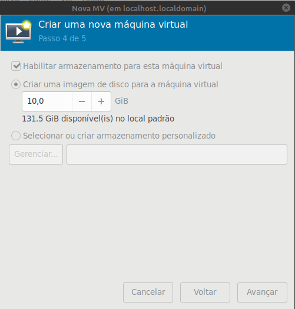
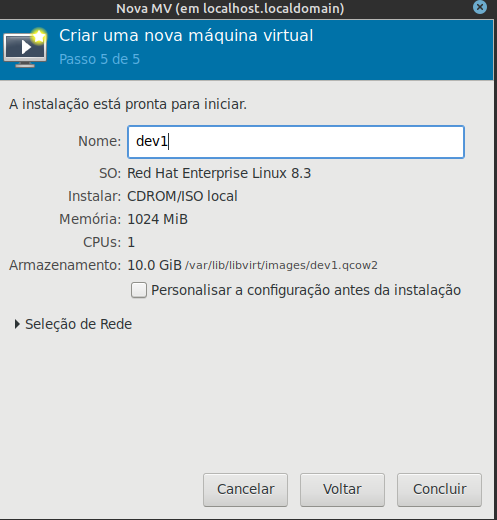
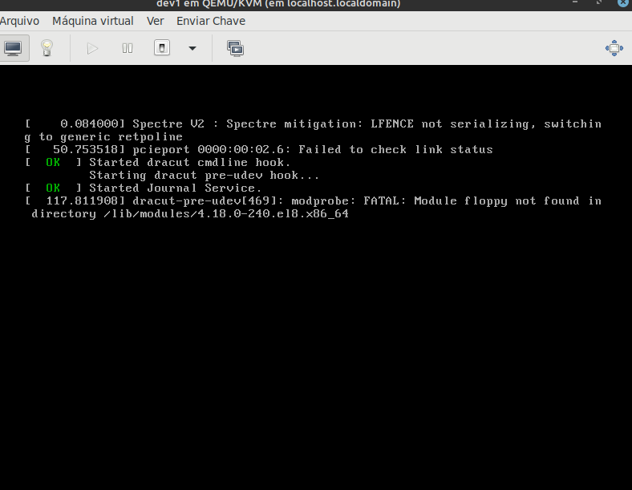
